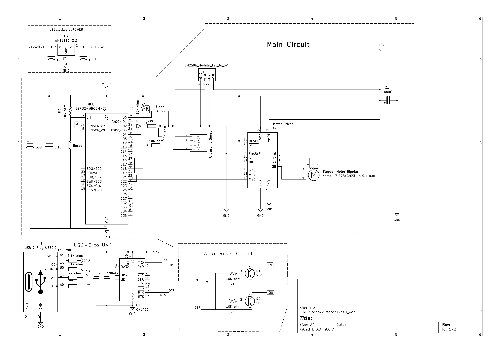
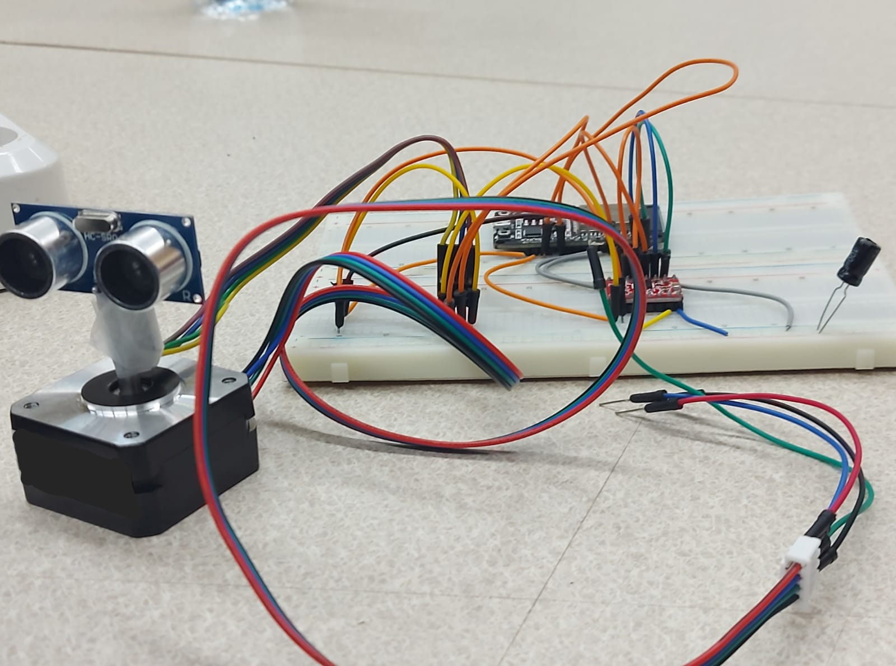

# Stepper Motor Driver
## Introduction
This is a simple project using a Nema 17 Stepper Motor, a A4988 Driver, HC-SR04 Ultrasonic sensor and an ESP32 Microcontroller. The idea is simple you control the stepper motor's speed,direction and step size using Python code.

## Prerequisites
* An ESP32 or any alternative
* Thonny or any Micropython IDE(ESP32 firmware can be installed within Thonny)
* USB COM Driver(ex. CP210x Silicon Labs)
* Nema 17 stepper motor
* A4988 driver or an alternative

## Schematic

When you look at the schematic, it is separated into 4 sections: Main circuit, USB Logic Circuit Power, Auto-Reset Circuit and USB-C_to_UART Circuit. If you already have the ESP32 Devkit board, then your main concern will only be Pin 4, Pin 15, Pin 18, Pin 19,Pin 21, Pin 22 and Pin 23. **Ignore the rest of the pins and the circuits and don't use them**. Otherwise, if you have only the ESP32-WROOM-32 Module and wish to build everything yourself, this schematic would be a good helping reference.

## Application

I'll assume you own the ESP32 Devkit microcontroller like most people.

The working idea is simple: there is an Ultrasonic sensor mounted on a stepper motor that rotates 180 degrees and when it detects anything in the range of 20 cm or less(can be adjusted as you like) it stops and the LED on the microcontroller blinks. Everytime it detects something it reverses direction. In the code provided, you can easily adjust the microstepping configuration for a more precise motion. The Ultrasonic sensor is simply mounted on the stepper motor by a tape.

## Important Notes

* **Don't forget to set the motor current limit on the A4988 driver first(check tutorials online).*VERY IMPORTANT***
* **Make sure the motor power, the A4988 driver and the microcontroller have common Ground**
* **Don't ignore the 100uF capacitor between the motor power source and ground. Every other capacitor can be ignored as it is already added and implemented in the ESP32 Devkit**
* **Always make sure to read about the stepper motor you want to buy and its driver very well, as ignoring some stuff can be costly and dangerous sometimes**

* **The HC-SR04 Ultrasonic sensor usually needs 5V while the ESP32 provides 3.3V. So you would need a voltage regulator module like LM2596 to stepdown the motor power from 12V to 5V. Or you can just use another source or method. Also the Echo pin outputs a 5V signal so make sure to step that down also using a Voltage Divider Circuit like the one in the circuit above before connecting Echo to any pin on the ESP32( 5V may be too much and will damage the GPIO Pin easily)**

## Final Words
This project isn't an advanced one and it works as an introductory project for the people getting in field of electronics or mechatronics. There are multiple other sources to learn from online for more advanced concepts. You can edit the code provided and extend it to your needs.
